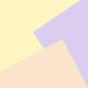
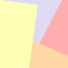
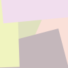

# IdentiColor

IdentiColor generates pastel SVG avatars from hexadecimal hashes.

## Install

```bash
npm install @stefanobalocco/identicolor
```

## Usage

ESM:

```js
import IdentiColor from '@stefanobalocco/identicolor';

const hash = '65dee7708ba413165fc2eaba3e991443d013f397b29e2c8acdced248c442e0ca';
const svg = IdentiColor( hash );
```

Browser module via jsDelivr:

```html
<script type="module">
	import IdentiColor from 'https://cdn.jsdelivr.net/npm/@stefanobalocco/identicolor@1.0.0/dist/IdentiColor.min.js';

	const hash = '65dee7708ba413165fc2eaba3e991443d013f397b29e2c8acdced248c442e0ca';
	const svg = IdentiColor( hash );
</script>
```

## Examples

  

## API

### `IdentiColor( hash, shapes? )`

- `hash`: hexadecimal input with a supported length. The function validates its length, not individual characters.
- `shapes`: optional number that defaults to `4`. Values from `3` through `5`, inclusive, create one background and two, three, or four foreground rectangle layers.

Returns the SVG string. Throws a `RangeError` for an unsupported hash length or shapes value.

## How it works

The function consumes bits from the hash to select a palette, order its colors through twelve fixed compare-exchange steps, and determine each rectangle's distance and rotation. It uses six pastel palettes; each rectangle is translated along a cardinal axis and independently rotated by a hash-derived value from `-35°` to `35°`.

## Acknowledgements

- Pastel palettes from [kdesign.co](https://kdesign.co/blog/pastel-color-palette-examples/)
- Inspired by [MetaMask's jazzicon](https://github.com/MetaMask/jazzicon)
